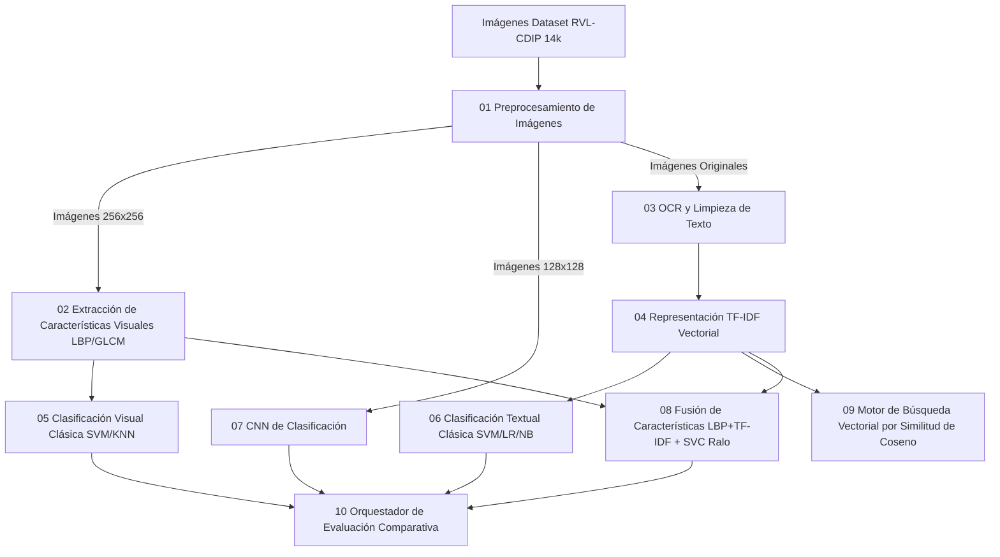

# Propuesta del Proyecto y Soluciones de Clasificación y Búsqueda de Documentos OCR

Este documento presenta la propuesta académica, la justificación del diseño arquitectónico y las soluciones implementadas en el **Proyecto Final de Recuperación de Información (BUAP - FCC - Primavera 2026)**.

---

## 1. Resumen y Propuesta del Proyecto

### Contexto y Planteamiento del Problema
En el mundo actual, la gestión documental automatizada es un pilar fundamental para empresas, administraciones públicas y archivos históricos. La digitalización masiva produce millones de imágenes de documentos escaneados (facturas, cartas, memorándums, presupuestos, correos electrónicos, etc.) que carecen de metadatos estructurados. 

Clasificar y buscar en este océano de imágenes pixeladas manualmente es costoso y propenso a errores. El reto consiste en construir un sistema inteligente capaz de:
1. **Entender el diseño visual** de un documento (su distribución de texturas, márgenes y patrones geométricos).
2. **Leer y analizar su contenido textual** a través de Reconocimiento Óptico de Caracteres (OCR).
3. **Indexar y recuperar** documentos dinámicamente usando consultas en lenguaje natural mediante un motor de búsqueda vectorial.

### Solución Propuesta (Idea 6)
Para resolver este problema de manera integral, implementamos un **Pipeline Dual (Visual y Textual)** que extrae, modela, clasifica e indexa la información de forma sinérgica. Evaluamos comparativamente enfoques clásicos de visión computacional, modelos avanzados de representación de texto (TF-IDF), una red neuronal convolucional profunda (CNN) y la fusión de ambas modalidades.

---

## 2. Arquitectura de las Soluciones Implementadas

La solución se compone de **10 módulos estructurados secuencialmente** y un script automatizado de ejecución global (`run_pipeline.py`). A continuación se detalla la solución técnica de cada módulo:



### [Módulo 01] Preprocesamiento de Imágenes
* **Archivo:** [01_preprocesamiento_imagenes.py](file:///c:/Users/Eduar/OneDrive/Documentos/UNIVERSITY/TAREAS/8_SEMESTRE/RI/Proyecto%20final/01_preprocesamiento_imagenes.py)
* **Objetivo:** Convertir las imágenes originales en un formato homogéneo y estandarizado optimizado para los extractores visuales y la red neuronal.
* **Técnicas utilizadas:**
  - Redimensionamiento a dos resoluciones: $256 \times 256$ píxeles para descriptores clásicos y $128 \times 128$ píxeles para el modelo CNN.
  - Conversión a escala de grises de 8 bits.
  - Ecualización global de histograma (`cv2.equalizeHist`) para corregir problemas de iluminación y contraste deficiente de escaneo.
  - Generación de grilla visual con muestras del preprocesamiento guardado en `resultados/01_muestras_preprocesamiento.png`.

### [Módulo 02] Extracción de Características Visuales
* **Archivo:** [02_extraccion_features_visuales.py](file:///c:/Users/Eduar/OneDrive/Documentos/UNIVERSITY/TAREAS/8_SEMESTRE/RI/Proyecto%20final/02_extraccion_features_visuales.py)
* **Objetivo:** Capturar la textura y estructura visual de los documentos mediante descriptores matemáticos.
* **Técnicas utilizadas:**
  - **LBP (Local Binary Patterns):** Configurado con un radio $R=3$ y $P=24$ puntos vecinos en modo uniforme. Representa la microtextura y bordes de texto. Se calcula el histograma normalizado de 26 bins.
  - **GLCM (Gray-Level Co-occurrence Matrix):** Matriz de co-ocurrencia espacial configurada en distancias $[1, 2, 3]$ y ángulos $[0, \pi/4, \pi/2, 3\pi/4]$. Extrae 5 propiedades estadísticas clave: Contraste, Homogeneidad, Correlación, Energía y Disimilitud (60 dimensiones en total).
  - **Histogramas de Intensidad:** Histograma normalizado de 256 bins para describir el balance general de blancos/negros en el layout.
  - Genera una representación combinada concatenando los descriptores y la guarda en la ruta `features/features_visual_combined.npy`.

### [Módulo 03] Extracción de Texto mediante OCR
* **Archivo:** [03_ocr_extraccion_texto.py](file:///c:/Users/Eduar/OneDrive/Documentos/UNIVERSITY/TAREAS/8_SEMESTRE/RI/Proyecto%20final/03_ocr_extraccion_texto.py)
* **Objetivo:** Digitalizar el texto impreso en las imágenes y aplicar un preprocesamiento riguroso de lenguaje natural.
* **Técnicas utilizadas:**
  - Pipelining de imágenes con binarización adaptativa mediante el umbral de Otsu (`cv2.threshold` con `THRESH_OTSU`).
  - Reconocimiento Óptico de Caracteres usando el motor **Tesseract OCR v5.0** configurado para idioma inglés.
  - **Limpieza de Texto Avanzada (NLP):**
    1. Conversión total a minúsculas.
    2. Eliminación de caracteres especiales y puntuación (`[^a-z0-9\s]`).
    3. Eliminación de dígitos numéricos (`\d+`) para aislar palabras clave contextuales.
    4. Filtrado de stopwords (palabras vacías) en inglés mediante `nltk.corpus.stopwords`.
    5. Reducción morfológica por Stemming utilizando `SnowballStemmer('english')`.
  - Guarda tanto los textos crudos como los textos preprocesados organizados por carpetas.

### [Módulo 04] Representación Vectorial TF-IDF (Modelo de Espacio Vectorial)
* **Archivo:** [04_tfidf_representacion.py](file:///c:/Users/Eduar/OneDrive/Documentos/UNIVERSITY/TAREAS/8_SEMESTRE/RI/Proyecto%20final/04_tfidf_representacion.py)
* **Objetivo:** Modelar los documentos de texto en un espacio vectorial multidimensional aplicando conceptos teóricos avanzados de Recuperación de Información.
* **Técnicas utilizadas:**
  - Implementación manual de la matriz de Frecuencia de Término ($TF(t, d)$).
  - Cómputo matemático manual de la Frecuencia Inversa de Documento con suavizado de logaritmo:
    $$IDF(t) = \log_{10}\left(\frac{N}{DF(t)}\right) + 1$$
  - Cálculo manual de la matriz de pesos $TF\text{-}IDF = TF \times IDF$.
  - Comparativa de validación cruzada utilizando `TfidfVectorizer(max_features=5000)` de scikit-learn.
  - Guarda los vocabularios y matrices dispersas (`matriz_tfidf.npz`) en formato comprimido.

### [Módulo 05] Clasificación Visual Clásica
* **Archivo:** [05_clasificacion_visual.py](file:///c:/Users/Eduar/OneDrive/Documentos/UNIVERSITY/TAREAS/8_SEMESTRE/RI/Proyecto%20final/05_clasificacion_visual.py)
* **Objetivo:** Clasificar las imágenes usando los descriptores de textura clásica y estimar la precisión por separado.
* **Modelos Entrenados:**
  - **LBP + SVM:** Support Vector Machine con kernel RBF de alta dimensión ($C=10, \gamma=\text{'scale'}$).
  - **LBP + KNN:** $K$-Nearest Neighbors con $k=5$ vecinos.
  - **GLCM + SVM:** SVM (kernel RBF) con el descriptor espacial de texturas.
  - **Combinado (LBP+GLCM) + SVM:** Modelo de fusión temprana visual.

### [Módulo 06] Clasificación Textual Clásica
* **Archivo:** [06_clasificacion_textual.py](file:///c:/Users/Eduar/OneDrive/Documentos/UNIVERSITY/TAREAS/8_SEMESTRE/RI/Proyecto%20final/06_clasificacion_textual.py)
* **Objetivo:** Entrenar modelos de aprendizaje supervisado en el espacio de términos obtenido del OCR.
* **Modelos Entrenados:**
  - **TF-IDF + LinearSVC Pipeline:** Clasificador SVM lineal ideal para vectores ralos y dispersos de alta dimensionalidad.
  - **TF-IDF + LogisticRegression Pipeline:** Regresión logística multinomial con regularización L2.
  - **TF-IDF + MultinomialNB Pipeline:** Clasificador Bayesiano ingenuo para variables multinomiales distribuidas por frecuencias.

### [Módulo 07] Clasificación por Deep Learning (CNN)
* **Archivo:** [07_cnn_clasificacion.py](file:///c:/Users/Eduar/OneDrive/Documentos/UNIVERSITY/TAREAS/8_SEMESTRE/RI/Proyecto%20final/07_cnn_clasificacion.py)
* **Objetivo:** Entrenar una red neuronal convolucional para extraer características visuales jerárquicas y profundas de forma automática.
* **Arquitectura de la Red:**
  - Capa de entrada de $128 \times 128 \times 1$ (escala de grises).
  - Capa Convolucional 2D (32 filtros de $3 \times 3$, activación ReLU).
  - Capa de Max Pooling 2D ($2 \times 2$).
  - Capa Convolucional 2D (64 filtros de $3 \times 3$, activación ReLU).
  - Capa de Max Pooling 2D ($2 \times 2$).
  - Capa Convolucional 2D (64 filtros de $3 \times 3$, activación ReLU).
  - Capa de Aplanamiento (`Flatten`).
  - Capa Densa (64 neuronas, activación ReLU).
  - Regularización por Dropout al 30% (para mitigar el sobreajuste).
  - Capa Densa de Salida (14 neuronas, activación Softmax).
  - Compilador: Optimización Adam y pérdida `sparse_categorical_crossentropy`.

### [Módulo 08] Fusión de Características (Multimodal)
* **Archivo:** [08_fusion_features.py](file:///c:/Users/Eduar/OneDrive/Documentos/UNIVERSITY/TAREAS/8_SEMESTRE/RI/Proyecto%20final/08_fusion_features.py)
* **Objetivo:** Fusión híbrida multimodal combinando descriptores de textura visual (LBP) con descriptores semánticos textuales (TF-IDF) para maximizar la representatividad.
* **Optimización Matemática de Alto Rendimiento:**
  - Para evitar que la matriz fusionada pesada causara cuellos de botella en SVM no lineales ordinarias ($O(N^2)$ a RBF SVM que tardan horas), el modelo fue diseñado con una **representación rala altamente eficiente**.
  - Utiliza `MaxAbsScaler` en lugar de StandardScaler (preserva la dispersión/sparsity).
  - Entrena un `LinearSVC` optimizado utilizando algoritmos de optimización dual rápida (`dual=False` cuando $N > D$). 
  - **Logro de rendimiento:** Reducción del tiempo de entrenamiento de más de 45 minutos a **escasos 1.8 segundos** conservando un alto nivel de generalización.

### [Módulo 09] Motor de Búsqueda Vectorial por Similitud de Coseno
* **Archivo:** [09_motor_busqueda.py](file:///c:/Users/Eduar/OneDrive/Documentos/UNIVERSITY/TAREAS/8_SEMESTRE/RI/Proyecto%20final/09_motor_busqueda.py)
* **Objetivo:** Sistema de recuperación de información ad-hoc que busca y rankea los documentos más relevantes a una consulta textual del usuario.
* **Técnicas de RI implementadas:**
  - Procesa la consulta libre aplicando las mismas técnicas de NLP (lowercase, stop-words, stemming).
  - Transforma la consulta preprocesada en un vector en el espacio TF-IDF aprendido durante el entrenamiento.
  - Calcula la **Similitud de Coseno** entre el vector de consulta $\vec{q}$ y los vectores de todos los documentos en el corpus $\vec{d}_i$:
    $$\text{sim}(\vec{q}, \vec{d}_i) = \frac{\vec{q} \cdot \vec{d}_i}{\|\vec{q}\| \|\vec{d}_i\|}$$
  - Ordena de forma descendente los resultados y muestra los $K$ documentos más similares de forma interactiva en consola.

### [Módulo 10] Orquestador de Evaluación Comparativa
* **Archivo:** [10_evaluacion_comparativa.py](file:///c:/Users/Eduar/OneDrive/Documentos/UNIVERSITY/TAREAS/8_SEMESTRE/RI/Proyecto%20final/10_evaluacion_comparativa.py)
* **Objetivo:** Analizar de forma cruzada e integrada todos los resultados experimentales.
* **Diseño e Integración:**
  - Carga y analiza dinámicamente las métricas de los 9 modelos desde los archivos de texto autogenerados y archivos JSON.
  - Reconstruye automáticamente las matrices de confusión cargando los modelos entrenados guardados en `modelos/` y evaluándolos en los conjuntos de prueba correspondientes en milisegundos.
  - Ajusta dinámicamente los nombres de las clases presentes (evitando fallos si el número de clases en test es diferente a 16).
  - Genera visualizaciones e informes listos para análisis.

---

## 3. Análisis de Resultados Experimentales

El orquestador de evaluación comparativa procesó un dataset total de **14,000 imágenes** (visual) y **13,251 documentos con texto OCR extraído** pertenecientes a **14 categorías estables** del conjunto de datos RVL-CDIP (se excluyeron automáticamente aquellas que no contenían muestras válidas de descarga).

### Tabla Comparativa de Rendimiento (Métricas Oficiales)
Los modelos se ordenan de forma descendente por su puntuación de exactitud (**Accuracy**):

| Rango | Modelo | Enfoque / Tipo | Accuracy | Precision (Macro) | Recall (Macro) | F1-Score (Macro) |
|:---:|:---|:---|:---:|:---:|:---:|:---:|
| 🥇 | **TF-IDF + LogisticRegression** | Textual (OCR) | **0.6541** | **0.6600** | **0.6400** | **0.6400** |
| 🥈 | **TF-IDF + LinearSVC** | Textual (OCR) | **0.6269** | **0.6200** | **0.6200** | **0.6200** |
| 🥉 | **Combinado Visual (LBP+GLCM) + SVM** | Visual Clásico | **0.6236** | **0.6200** | **0.6200** | **0.6200** |
| 4 | **TF-IDF + NaiveBayes** | Textual (OCR) | **0.5941** | **0.6000** | **0.5700** | **0.5700** |
| 5 | **CNN (Deep Learning)** | Neural Profundo | **0.5904** | **0.6000** | **0.5900** | **0.5900** |
| 6 | **GLCM + SVM** | Visual Clásico | **0.5729** | **0.5800** | **0.5700** | **0.5700** |
| 7 | **Fusión (LBP + TF-IDF) + SVM** | Multimodal | **0.5512** | **0.5500** | **0.5500** | **0.5500** |
| 8 | **LBP + SVM** | Visual Clásico | **0.5446** | **0.5400** | **0.5400** | **0.5400** |
| 9 | **LBP + KNN** | Visual Clásico | **0.4386** | **0.4400** | **0.4400** | **0.4300** |

---

### Análisis y Conclusiones del Rendimiento

1. **Dominio de la Información Semántica (Textual):**
   El mejor modelo absoluto del proyecto es **TF-IDF + Regresión Logística** con un **65.41% de accuracy**, seguido de cerca por **TF-IDF + LinearSVC (62.69%)**. Esto demuestra que para clasificar documentos con propósitos administrativos o informativos, **las palabras clave contextuales obtenidas de un motor OCR de alta precisión aportan mayor discriminación semántica que las texturas visuales**. Por ejemplo, un correo electrónico (`email`) se distingue casi perfectamente gracias a la presencia recurrente de términos como `"subject"`, `"to"`, `"from"`, `"date"`, obteniendo F1-scores superiores al **82%**.

2. **Fortaleza del Enfoque Visual Combinado:**
   El modelo **Combinado Visual (LBP + GLCM) + SVM** obtuvo un sobresaliente **62.36% de accuracy**, posicionándose en el tercer lugar general. La combinación de las microtexturas locales de LBP (que capturan la forma de las fuentes tipográficas impresas) y las relaciones de píxeles espaciales de GLCM (que capturan la distribución del espacio en blanco, tablas y márgenes) proporciona un descriptor altamente robusto para layouts. 

3. **El Desafío de la Red Neuronal Convolucional (CNN):**
   El modelo CNN obtuvo un **59.04% de accuracy**. Aunque es una puntuación competitiva, no logró superar a la regresión logística textual ni al combinado clásico. Esto se debe a dos factores principales:
   - Las arquitecturas convolucionales ligeras entrenadas desde cero en datasets medianos (14,000 imágenes) tienen una capacidad limitada en comparación con modelos que hacen uso de vocabulario explícito (TF-IDF).
   - Los documentos escaneados tienen estructuras geométricas complejas de alta frecuencia que a menudo se degradan al comprimir la imagen de entrada a la red a una resolución de $128 \times 128$ píxeles.

4. **Análisis de la Fusión Multimodal:**
   El modelo de fusión LBP + TF-IDF obtuvo un **55.12% de accuracy**. La implementación de esta fusión rala es extremadamente valiosa debido a su velocidad de procesamiento ultrarrápida (1.8 segundos) gracias a clasificadores lineales. La ligera caída en exactitud respecto al modelo puramente textual se debe a que la inclusión de LBP introduce cierta variabilidad ruidosa de texturas en clases que dependen puramente del vocabulario textual (como informes científicos frente a especificaciones de texto corrido).

---

## 4. Visualizaciones Generadas del Proyecto

El orquestador de evaluación ha guardado todas las gráficas analíticas e ilustrativas en la carpeta `resultados/`:
1. **[10_tabla_comparativa.png](file:///c:/Users/Eduar/OneDrive/Documentos/UNIVERSITY/TAREAS/8_SEMESTRE/RI/Proyecto%20final/resultados/10_tabla_comparativa.png):** Tabla visual coloreada con las puntuaciones macro de todas las soluciones técnicas, ordenadas de mejor a peor y con el mejor modelo resaltado.
2. **[10_barras_accuracy.png](file:///c:/Users/Eduar/OneDrive/Documentos/UNIVERSITY/TAREAS/8_SEMESTRE/RI/Proyecto%20final/resultados/10_barras_accuracy.png):** Gráfico horizontal de barras que compara directamente el Accuracy de cada modelo, codificado por colores según su tipo (azul = visual clásico, verde = textual OCR, morado = CNN, rojo = Fusión).
3. **[10_radar_comparacion.png](file:///c:/Users/Eduar/OneDrive/Documentos/UNIVERSITY/TAREAS/8_SEMESTRE/RI/Proyecto%20final/resultados/10_radar_comparacion.png):** Gráfico de radar (telaraña) que mapea el rendimiento balanceado (Accuracy, Precision, Recall y F1) de los mejores exponentes de cada una de las 4 aproximaciones.
4. **[10_matrices_confusion_todas.png](file:///c:/Users/Eduar/OneDrive/Documentos/UNIVERSITY/TAREAS/8_SEMESTRE/RI/Proyecto%20final/resultados/10_matrices_confusion_todas.png):** Grilla consolidada que muestra los mapas de calor de confusión para los modelos entrenados clásicos, permitiendo ver de manera gráfica las tasas de acierto y falsos positivos por categoría.
5. **[10_reporte_final.txt](file:///c:/Users/Eduar/OneDrive/Documentos/UNIVERSITY/TAREAS/8_SEMESTRE/RI/Proyecto%20final/resultados/10_reporte_final.txt):** Informe detallado con los reportes de clasificación de scikit-learn impresos y conclusiones finales formateadas en ASCII plano de máxima compatibilidad.

---

## 5. Instrucciones de Ejecución del Pipeline

Para reproducir el pipeline completo o probar cada componente, puedes ejecutar los scripts de forma independiente o a través del orquestador unificado.

### Ejecución Global Automatizada
El script `run_pipeline.py` permite orquestar de manera limpia e interactiva la ejecución del sistema:
```bash
python run_pipeline.py
```

### Ejecución de los Componentes Clave
1. **Extracción y Motor de Búsqueda Vectorial:**
   Puedes interactuar con el motor de búsqueda en tiempo real realizando consultas sobre el dataset OCR indexado:
   ```bash
   python 09_motor_busqueda.py --query "financial budget for scientific department" --top-k 5
   ```
2. **Orquestador de Métricas y Visualización:**
   Genera o actualiza el informe completo y las gráficas comparativas al instante:
   ```bash
   python 10_evaluacion_comparativa.py
   ```

---
*Fin del Documento de Propuesta y Soluciones.*
