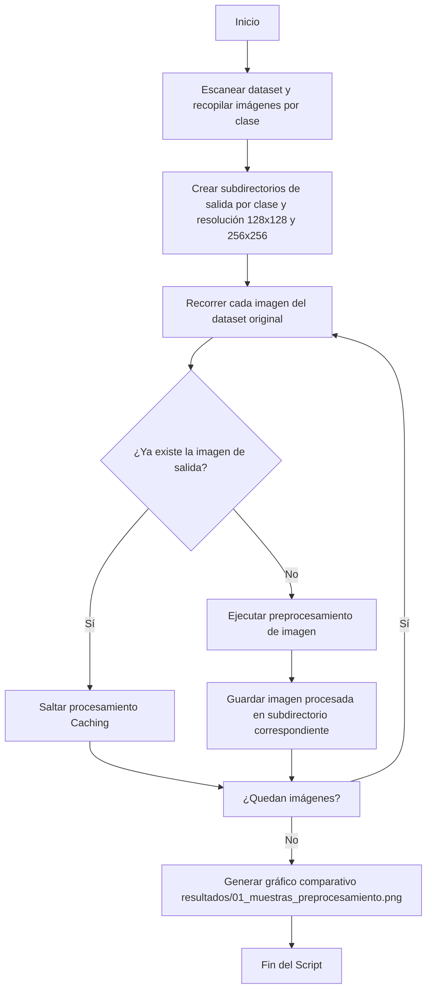

# Resumen Rápido: `01_preprocesamiento_imagenes.py`

Este documento proporciona una guía de referencia rápida sobre los **pasos del pipeline** y las **funciones** principales del módulo de preprocesamiento de imágenes.

---

## 🛠️ Pasos del Pipeline de Ejecución

El script sigue un flujo secuencial automatizado para preparar las imágenes del dataset:

1.  **Validación de Entradas:** Verifica que el directorio original del dataset (`dataset/`) exista y contenga carpetas por clase.
2.  **Configuración de Directorios:** Genera subcarpetas separadas por resolución (`128x128/` para la rama CNN y `256x256/` para la rama de descriptores) e inicializa las 14 carpetas de clases en cada una de ellas.
3.  **Filtrado por Caché:** Detecta si la imagen procesada ya existe en el directorio de destino para evitar consumos de CPU repetitivos.
4.  **Bucle de Preprocesamiento:** Aplica transformaciones de color, tamaño y contraste a nivel de píxel a cada imagen.
5.  **Generación de Muestras:** Toma una muestra aleatoria de clases y renderiza una gráfica comparativa del preprocesamiento.

---

## ⚙️ Especificación de Funciones

A continuación se detalla la firma, parámetros y propósito de cada función del código:

### 1. `preprocesar_imagen(ruta_imagen, tamano)`
*   **Propósito:** Aplica las operaciones OpenCV sobre un archivo individual de imagen.
*   **Parámetros:**
    *   `ruta_imagen` (*str*): Ruta física al archivo de imagen original.
    *   `tamano` (*tuple*): Tupla con la resolución de salida esperada `(ancho, alto)`.
*   **Retorno:** `np.ndarray` (imagen procesada en escala de grises) o `None` si la imagen no se pudo abrir o procesar.
*   **Algoritmo interno:**
    1.  Lectura de archivo en escala de grises mediante `cv2.imread`.
    2.  Conversión dinámica a escala de grises si la imagen original es RGB o BGR.
    3.  Redimensionamiento dinámico: Usa `cv2.INTER_AREA` (para reducción, evitando aliasing) o `cv2.INTER_LINEAR` (para ampliación).
    4.  Mejora de contraste local: Inicializa e implementa **CLAHE** (ecualización de histograma adaptativa limitada por contraste) con `clipLimit=2.0` y `tileGridSize=(8, 8)`.

### 2. `crear_directorios_salida(dir_salida)`
*   **Propósito:** Prepara la estructura física de almacenamiento de salida.
*   **Parámetros:**
    *   `dir_salida` (*str*): Ruta raíz de destino.
*   **Retorno:** `dict` que mapea `{resolución: {clase: ruta_directorio}}`.
*   **Algoritmo interno:** Itera sobre las resoluciones configuradas (`128x128` y `256x256`) y la lista de clases detectadas del dataset, creando las carpetas físicas mediante `os.makedirs` recursivo.

### 3. `obtener_imagenes_por_clase(dir_entrada)`
*   **Propósito:** Escanea y clasifica en memoria todas las imágenes del dataset original.
*   **Parámetros:**
    *   `dir_entrada` (*str*): Directorio raíz del dataset de entrada.
*   **Retorno:** `dict` que asocia `{nombre_clase: [lista_rutas_imagenes]}`.
*   **Algoritmo interno:** Recorre cada directorio de clase y ejecuta búsquedas mediante comodines `glob` para extensiones de imagen comunes (`.jpg`, `.jpeg`, `.png`, `.tif`, `.tiff`, `.bmp`). Devuelve un reporte resumido del dataset por consola.

### 4. `generar_visualizacion_muestras(dir_entrada, dir_salida, ruta_visualizacion, n_muestras=4)`
*   **Propósito:** Renderiza y guarda una gráfica de análisis visual para control de calidad.
*   **Parámetros:**
    *   `dir_entrada` (*str*), `dir_salida` (*str*): Directorios de origen y destino del dataset.
    *   `ruta_visualizacion` (*str*): Ruta destino donde guardar la imagen resultante.
    *   `n_muestras` (*int*): Cantidad de muestras comparativas a graficar (por defecto 4).
*   **Retorno:** `None` (guarda la gráfica en disco).
*   **Algoritmo interno:** Mezcla aleatoriamente las clases del dataset, selecciona una imagen muestra por clase, comprueba que existan sus versiones procesadas de `128x128` y `256x256`, y crea una cuadrícula de comparación de Matplotlib con el backend de graficado no interactivo `Agg`.

### 5. `ejecutar_preprocesamiento(dir_entrada, dir_salida)`
*   **Propósito:** Orquestador principal de ejecución del pipeline.
*   **Parámetros:**
    *   `dir_entrada` (*str*), `dir_salida` (*str*): Rutas de origen y destino.
*   **Retorno:** `None`.
*   **Algoritmo interno:** Coordina el escaneo del dataset, la inicialización de carpetas de salida, ejecuta el bucle de preprocesamiento imprimiendo estadísticas y barras de progreso `tqdm`, y finalmente genera la visualización de muestras.
