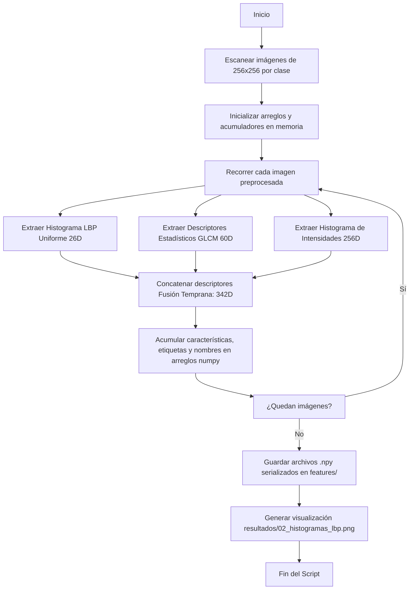

# Resumen Rápido: `02_extraccion_features_visuales.py`

Este documento proporciona una guía de referencia rápida sobre los **pasos del pipeline** y las **funciones** principales del módulo de extracción de características visuales clásicas.

---

## 🛠️ Pasos del Pipeline de Ejecución

El script extrae firmas numéricas de textura y contraste a partir de las imágenes de resolución 256x256:

1.  **Carga del Dataset Preprocesado:** Lee las imágenes en escala de grises de 256x256 guardadas previamente.
2.  **Extracción de Texturas Locales:** Computa el descriptor LBP para identificar micro-estructuras textuales y de contorno.
3.  **Análisis de Relación Espacial:** Genera matrices GLCM a diferentes distancias y ángulos para cuantificar contraste, homogeneidad y energía.
4.  **Perfil de Contraste Global:** Obtiene la densidad de grises mediante histogramas de intensidad normalizados.
5.  **Concatenación y Fusión:** Une las 3 familias de características en un vector descriptor integrado por documento.
6.  **Guardado Binario:** Escribe los vectores agregados a disco como arreglos binarios NumPy (`.npy`) en el directorio `features/`.
7.  **Visualización:** Genera curvas promediadas LBP con desviaciones estándar para cada clase.

---

## ⚙️ Especificación de Funciones

A continuación se detalla la firma, parámetros y propósito de cada función del código:

### 1. `extraer_lbp(imagen)`
*   **Propósito:** Extrae descriptores de textura local robustos a cambios de luz.
*   **Parámetros:**
    *   `imagen` (*np.ndarray*): Imagen en escala de grises de 256x256 píxeles.
*   **Retorno:** `np.ndarray` (histograma normalizado de 26 dimensiones, `float32`).
*   **Algoritmo interno:**
    1.  Calcula el mapa LBP con vecindario circular ($R=3$, $P=24$) y método `'uniform'`.
    2.  Calcula el histograma de frecuencias con 26 bins.
    3.  Aplica normalización probabilística (`density=True`) para garantizar la invariabilidad al tamaño de imagen.

### 2. `extraer_glcm(imagen)`
*   **Propósito:** Extrae propiedades de regularidad espacial de tonos de gris.
*   **Parámetros:**
    *   `imagen` (*np.ndarray*): Imagen en escala de grises.
*   **Retorno:** `np.ndarray` (vector de características estadísticas de 60 dimensiones, `float32`).
*   **Algoritmo interno:**
    1.  Cuantiza la imagen dividiendo los niveles de gris entre 4 (`imagen // 4`), convirtiendo la escala de 256 a 64 niveles.
    2.  Construye la matriz de co-ocurrencia (`graycomatrix`) usando distancias $[1, 2, 3]$ y ángulos $[0, \pi/4, \pi/2, 3\pi/4]$ (direcciones horizontal, vertical y diagonales).
    3.  Extrae 5 propiedades estadísticas de Haralick: *contraste, disimilitud, homogeneidad, energía* y *correlación* usando `graycoprops`.
    4.  Aplana y concatena el resultado ($5 \text{ propiedades} \times 3 \text{ distancias} \times 4 \text{ ángulos} = 60 \text{ valores}$).

### 3. `extraer_histograma_intensidad(imagen)`
*   **Propósito:** Genera el perfil empírico de distribución de tinta.
*   **Parámetros:**
    *   `imagen` (*np.ndarray*): Imagen en escala de grises.
*   **Retorno:** `np.ndarray` (histograma de 256 dimensiones, `float32`).
*   **Algoritmo interno:** Computa la densidad de distribución de píxeles sobre 256 bins uniformes utilizando `np.histogram` normalizado.

### 4. `obtener_imagenes_por_clase(dir_entrada)`
*   **Propósito:** Lista y agrupa las imágenes de resolución 256x256 por clase.
*   **Parámetros:**
    *   `dir_entrada` (*str*): Directorio raíz con las imágenes preprocesadas.
*   **Retorno:** `dict` que asocia `{nombre_clase: [lista_rutas_imagenes]}`.

### 5. `generar_visualizacion_lbp(features_lbp, labels, nombres_clases, ruta_salida)`
*   **Propósito:** Renderiza una comparativa de los perfiles de textura LBP promedio por categoría de documento.
*   **Parámetros:**
    *   `features_lbp` (*np.ndarray*): Matriz agregada LBP de forma `(N, 26)`.
    *   `labels` (*np.ndarray*): Vector con las etiquetas de clases `(N,)`.
    *   `nombres_clases` (*list*): Nombres de las categorías de documentos.
    *   `ruta_salida` (*str*): Destino donde guardar el gráfico `.png`.
*   **Retorno:** `None`.
*   **Algoritmo interno:** Crea una grilla de sub-gráficos en Matplotlib. Para cada clase, calcula el promedio LBP y su desviación estándar, graficando las barras del histograma y bandas transparentes de variabilidad.

### 6. `ejecutar_extraccion(dir_entrada, dir_salida)`
*   **Propósito:** Orquestador del pipeline de análisis de texturas.
*   **Parámetros:**
    *   `dir_entrada` (*str*), `dir_salida` (*str*): Rutas físicas de origen y destino.
*   **Retorno:** `None`.
*   **Algoritmo interno:** Ejecuta recursivamente los extractores sobre cada imagen preprocesada, empaqueta los resultados en matrices NumPy, realiza la fusión de descriptores (342D), serializa los arreglos independientes en formato `.npy` en disco y finalmente dispara la visualización LBP.
