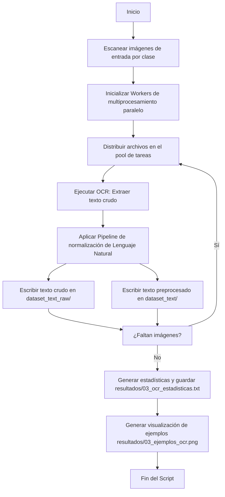

# Resumen Rápido: `03_ocr_extraccion_texto.py` y `03_ocr_extraccion_texto_paddle.py`

Este documento proporciona una guía de referencia rápida sobre los **pasos del pipeline** y las **funciones** principales de los módulos de extracción y normalización textual OCR.

---

## 🛠️ Pasos del Pipeline de Ejecución

Ambos scripts transforman los píxeles de documentos impresos en colecciones normalizadas de palabras (tokens) listas para indexación vectorial:

1.  **Detección e Inicialización:** Verifica la disponibilidad del motor Tesseract u inicializa de forma perezosa el modelo de PaddleOCR.
2.  **Multiprocesamiento:** Instancia un pool de procesos paralelos para repartir los documentos entre los núcleos de la CPU.
3.  **Binarización:** Convierte a escala de grises y calcula el umbral de Otsu para maximizar el contraste de los caracteres tipográficos.
4.  **Inferencia OCR:** Ejecuta el motor neuronal (Tesseract LSTM o redes DBNet/SVTR de PaddleOCR) obteniendo caracteres en crudo.
5.  **Limpieza NLP:** Normaliza a minúsculas, remueve signos de puntuación, números y stopwords, finalizando con un derivador de raíces (stemming).
6.  **Guardado Físico:** Almacena la versión original del texto extraído y su equivalente procesado en archivos `.txt`.
7.  **Estadísticas y Ejemplos:** Reporta la tasa de éxito de extracción, velocidad e ilustra ejemplos de conversión.

---

## ⚙️ Especificación de Funciones

### A. Funciones Comunes y específicas de Tesseract (`03_ocr_extraccion_texto.py`)

#### 1. `preprocesar_imagen(ruta_imagen)`
*   **Propósito:** Mejora la imagen antes de alimentar al OCR para disminuir falsos positivos.
*   **Parámetros:** `ruta_imagen` (*str*).
*   **Retorno:** `np.ndarray` (imagen binaria monocromática) o `None`.
*   **Algoritmo interno:** Binarización global mediante umbralización de Otsu (`cv2.THRESH_BINARY + cv2.THRESH_OTSU`).

#### 2. `extraer_texto_ocr(ruta_imagen)`
*   **Propósito:** Llama al wrapper de Tesseract para procesar una imagen binaria.
*   **Parámetros:** `ruta_imagen` (*str*).
*   **Retorno:** `str` (texto crudo).
*   **Configuración:** `--psm 6` (bloque de texto único) y `--oem 3` (motor LSTM por defecto).

#### 3. `preprocesar_texto(texto)`
*   **Propósito:** Transforma el texto crudo en una lista ordenada de raíces semánticas.
*   **Parámetros:** `texto` (*str*).
*   **Retorno:** `str` (cadena unificada de tokens separados por espacio).
*   **Pipeline secuencial:**
    1.  `lower()`: Conversión a minúsculas.
    2.  `re.sub(r'[^a-z0-9\s]', '', texto)`: Remoción de signos especiales.
    3.  `re.sub(r'\d+', '', texto)`: Eliminación de dígitos numéricos.
    4.  `re.sub(r'\s+', ' ', texto)`: Colapso de espacios en blanco redundantes.
    5.  Tokenización por espacios y filtro de stopwords de inglés (`nltk.corpus.stopwords`) con longitud mayor a 1 carácter.
    6.  Reducción a raíces morfológicas usando `SnowballStemmer('english')`.

#### 4. `procesar_archivo(args_tupla)`
*   **Propósito:** Unidad lógica de procesamiento paralelo por archivo.
*   **Parámetros:** `args_tupla` (*tuple* conteniendo `(ruta_imagen, ruta_raw, ruta_procesado)`).
*   **Retorno:** `dict` con métricas de rendimiento y resúmenes del texto extraído.

---

### B. Algoritmos Especiales de PaddleOCR (`03_ocr_extraccion_texto_paddle.py`)

Esta variante avanzada implementa lógica geométrica adicional para reconstruir el flujo de lectura humana y ordenar textos en columnas complejas:

#### 1. `init_paddle_ocr()`
*   **Propósito:** Inicializa de forma perezosa y segura una única instancia de `PaddleOCR` por proceso worker para evitar colisiones de memoria en la GPU/CPU.

#### 2. `extraer_texto_paddle(ruta_imagen)`
*   **Propósito:** Detecta cajas de texto individuales y reconstruye su orden de lectura.
*   **Parámetros:** `ruta_imagen` (*str*).
*   **Retorno:** `str` (texto estructurado y ordenado).
*   **Algoritmo geométrico interno:**
    1.  Ejecuta la predicción del modelo de PaddleOCR para obtener cajas de texto y coordenadas de polígonos.
    2.  **DSU (Disjoint Set Union):** Agrupa líneas fragmentadas en "burbujas de lectura" o párrafos si sus coordenadas espaciales colindan horizontal o verticalmente mediante la función `misma_burbuja`.
    3.  **Ordenamiento de Columnas:** Clasifica los bloques agrupados verticalmente por renglón (`center_y`) y de izquierda a derecha (`center_x`) para garantizar la lectura secuencial de columnas paralelas antes de concatenar el texto.
